## Batch consumer-resource model: equations and assumptions

Version 2 | 25 species | finite starting food | two cross-fed metabolites | simulation time 0-300. This is an exploratory, well-mixed, fixed-volume model in normalized units, not a calibrated prediction for identified bacterial species. Nutrient affinities and starvation mortality add ecological differences without inventing direct pairwise fighting.

## What changed and how to run

The notebook is self-contained: its first code cell embeds the model and analysis code, so model.py does not need to be found. Download revised_analysis.ipynb and use Run All in a Python environment with numpy, scipy, pandas, matplotlib and IPython. The full ZIP also includes reusable model.py, analysis_tools.py, run_simulation.py, check_model.py, requirements.txt and saved figures/CSVs. Run python -m pip install -r requirements.txt, then python run_simulation.py --seed 42 --replicates 10 --output outputs. Notebook calculations write to outputs_notebook, leaving bundled command-line outputs separate.

Five conditions are compared. Baseline retains the original fixed K and constant mortality. Affinity changes only K; starvation changes only mortality; both changes both. Structured additionally changes food specialization, secretion types and starting abundances. The first four share the same baseline trait draws and starting biomasses, permitting controlled comparisons. Structured is a joint ecological scenario and cannot isolate individual mechanisms.

No changes were made to the extinction cutoff to force extinctions. Species can consume metabolites they produce. Food sources are substitutable: any allowed food supports growth, and multiple foods contribute additively. The model does not require simultaneous carbon, nitrogen or amino-acid acquisition.

## State variables and units

| Symbol | Meaning / units |
| --- | --- |
| N_i | Living biomass concentration of species i (normalized energy-equivalent biomass) |
| R_0, R_1, R_2 | Extracellular energy concentrations of initial food R0 and metabolites M1/M2 |
| L | Cumulative living biomass removed through mortality |
| C | Cumulative small biomass removed at extinction events |
| t | Normalized time; not automatically hours |
| i, alpha | i = 1,...,25; alpha = 0,1,2 indexes R0,M1,M2 |

R0 starts at 1 and both metabolites at zero. Total initial living biomass is 0.01. Baseline/affinity/starvation/both divide it equally: N_i(0)=0.0004. Structured uses lognormal weights normalized to the same total. No dilution, resource replenishment, intrinsic chemical decay, or usable dead-biomass recycling is included.

## 1. Resource uptake and growth capacity

A food-permission mask specifies which chemicals each species can consume. Preferences P_i,alpha are nonnegative, zero for forbidden foods, and sum to one across allowed foods. l_i is the fraction of R0 uptake released as metabolites. Retained fractions are:

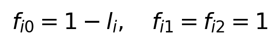

Plain-text equivalent: R0 retention = 1 - leakage; metabolite retention = 1.

LaTeX source: `f_{i0}=1-l_i,\quad f_{i1}=f_{i2}=1`

Growth scores s_i are sampled once and translated to maximum gross growth mu_i,max. Total uptake V_i is calibrated so that equal growth scores have equal maximum growth even if their food portfolios expose them to different leakage losses.

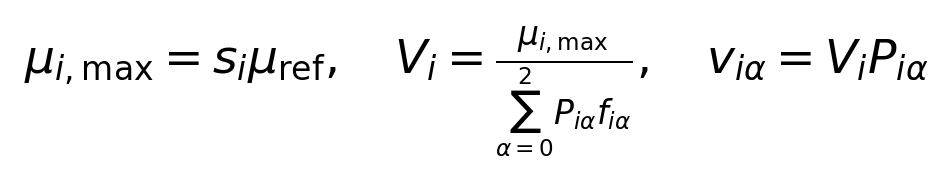

Plain-text equivalent: mu_max = score times reference rate; total capacity = mu_max / retained preference sum; food capacity = total capacity times preference.

LaTeX source: `\mu_{i,\max}=s_i\mu_{\mathrm{ref}},\quad V_i=\frac{\mu_{i,\max}}{\sum_{\alpha=0}^{2}P_{i\alpha}f_{i\alpha}},\quad v_{i\alpha}=V_iP_{i\alpha}`

This prevents generalists from automatically obtaining three times the total capacity of specialists. It is a modeling constraint, not a measured physiological law. No growth-affinity, growth-yield or growth-survival tradeoff is imposed.

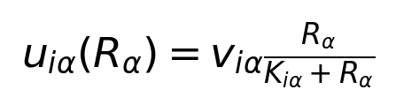

Plain-text equivalent: Uptake per unit biomass = maximum food uptake times R / (K + R).

LaTeX source: `u_{i\alpha}(R_\alpha)=v_{i\alpha}\frac{R_\alpha}{K_{i\alpha}+R_\alpha}`

u_i,alpha has units of chemical energy per biomass per time. v_i,alpha is its saturating maximum. K_i,alpha is the half-saturation concentration: lower K means more efficient uptake at scarce food. If food is zero, uptake is zero. If the species is forbidden from consuming a chemical, v is zero regardless of K.

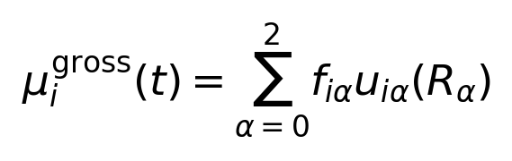

Plain-text equivalent: Gross growth = retained R0 uptake + M1 uptake + M2 uptake.

LaTeX source: `\mu_i^{\mathrm{gross}}(t)=\sum_{\alpha=0}^{2}f_{i\alpha}u_{i\alpha}(R_\alpha)`

The retained uptake energy becomes living biomass with unit yield in normalized energy units. This is accounting rather than a claim that real nutrients have equal mass yields or zero respiration losses. Metabolite uptake produces no additional modeled metabolite. Affinity variation affects low-food uptake, not mu_max at saturation. Independent affinity and growth draws allow some species to be good at both; a fast-growth/low-affinity tradeoff is a possible future hypothesis.

## 2. Mortality and the biomass ODE

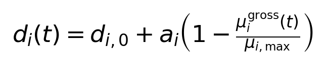

Plain-text equivalent: Death rate = baseline death + starvation increment times (1 - fraction of maximum gross growth).

LaTeX source: `d_i(t)=d_{i,0}+a_i\left(1-\frac{\mu_i^{\mathrm{gross}}(t)}{\mu_{i,\max}}\right)`

d_i,0 is basal mortality; a_i is the maximum extra starvation mortality. The growth fraction is numerically clipped to [0,1]. The positive sampled growth capacities make the denominator well-defined. In baseline and affinity, a_i=0. With abundant food and saturated uptake, d_i=d_i,0. With no usable food, d_i=d_i,0+a_i. Only nutrients that a species can consume affect its mortality through growth.

This is an instantaneous phenomenological starvation response, not a standard physiological survival law. It omits delayed damage, dormancy, maintenance energy, history and necromass feeding. It can strongly penalize metabolite-only consumers before their food appears. The starvation scale is exploratory and must be sensitivity-tested; it was not estimated from bacterial measurements.

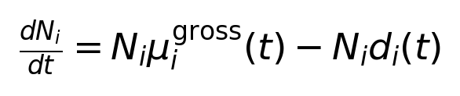

Plain-text equivalent: Biomass derivative = biomass production flux minus biomass mortality flux.

LaTeX source: `\frac{dN_i}{dt}=N_i\mu_i^{\mathrm{gross}}(t)-N_i d_i(t)`

The first term creates living biomass using retained resource energy. The second removes living biomass into the mortality-accounting sink. Gross and death rates are per-capita quantities; their biomass fluxes depend on current N_i. Net per-capita growth is mu_i,gross - d_i. A negative net rate causes continuous decline, not immediate threshold extinction.

Maximum growth, basal mortality, starvation increment and affinity are sampled independently. There is no rule that faster growers must die faster. Starvation mortality depends on current relative nutrient-supported growth, so two species with the same basal mortality can experience different death histories.

## 3. Chemical ODEs: consumption and cross-feeding

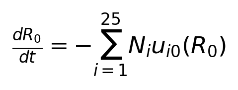

Plain-text equivalent: R0 derivative = negative total starting-food uptake.

LaTeX source: `\frac{dR_0}{dt}=-\sum_{i=1}^{25}N_i u_{i0}(R_0)`

R0 can only decrease through uptake. It has no supply, regeneration, secretion into R0, abiotic decay or dilution term.

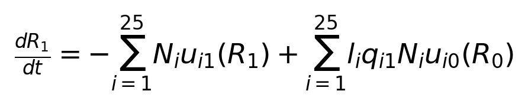

Plain-text equivalent: M1 derivative = negative total M1 uptake + M1 secretion from R0 uptake.

LaTeX source: `\frac{dR_1}{dt}=-\sum_{i=1}^{25}N_i u_{i1}(R_1)+\sum_{i=1}^{25}l_iq_{i1}N_i u_{i0}(R_0)`

Plain-text equivalent: M2 derivative = negative total M2 uptake + M2 secretion from R0 uptake.

LaTeX source: `\frac{dR_2}{dt}=-\sum_{i=1}^{25}N_i u_{i2}(R_2)+\sum_{i=1}^{25}l_iq_{i2}N_i u_{i0}(R_0)`

q_i1+q_i2=1 partitions leaked energy. The negative terms are consumption by any permitted species, including the producer itself. The positive terms create metabolites only when a species consumes R0. No metabolite-to-metabolite loops exist in this version. Chemical persistence means no intrinsic decay; uptake can still deplete metabolites. Production permissions and consumption permissions are distinct.

## 4. Energy accounting, extinction and solver

Plain-text equivalent: Mortality sink derivative = total mortality flux; cutoff sink is constant between events.

LaTeX source: `\frac{dL}{dt}=\sum_{i=1}^{25}N_i d_i(t),\qquad\frac{dC}{dt}=0\ \mathrm{between\ events}`

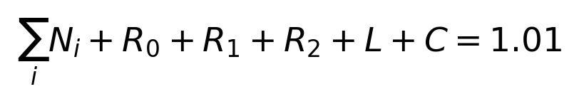

Plain-text equivalent: Living biomass + all usable chemicals + mortality losses + cutoff losses = initial total 1.01.

LaTeX source: `\sum_i N_i+R_0+R_1+R_2+L+C=1.01`

When a species crosses the common absolute cutoff downward, integration stops, its residual biomass is transferred to C, and N_i is set to zero permanently. No resurrection or relative-abundance renormalization is performed. Cutoff losses are discrete jumps, not an ODE term. The same absolute cutoff is used for unequal-abundance scenarios to avoid giving initially rare species a different numerical definition of extinction.

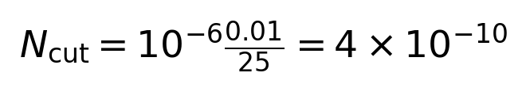

Plain-text equivalent: Extinction cutoff = 1e-6 times the equal-share initial biomass = 4e-10.

LaTeX source: `N_{\mathrm{cut}}=10^{-6}\frac{0.01}{25}=4\times10^{-10}`

This is a numerical convention rather than a universal experimental detection limit. Cutoff comparisons use 1e-4,1e-6,1e-8 times equal-share starting biomass while keeping the same species draws. Species removed before metabolite production cannot recover when food appears later. Survivorship is assessed at t=300, not at an infinite-time equilibrium.

DOP853 solves the coupled ODEs with relative tolerance 1e-8, absolute tolerance 1e-13, and maximum step 2. Outputs are stored at 1201 evenly spaced times (spacing 0.25). Terminal downward events enforce irreversible extinction. Code checks states for numerical negativity and an energy-accounting error below 1e-6. No-food tests compare biomass with N_i(0) exp[-(d_i,0+a_i)t] before cutoff removal.

## 5. Shannon diversity and community statistics

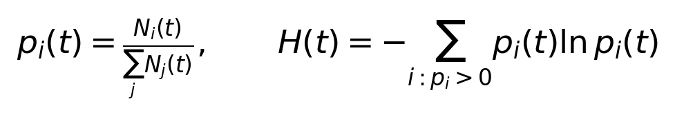

Plain-text equivalent: Relative biomass = species biomass / living total; Shannon H = negative sum of p log p.

LaTeX source: `p_i(t)=\frac{N_i(t)}{\sum_jN_j(t)},\qquad H(t)=-\sum_{i:p_i>0}p_i(t)\ln p_i(t)`

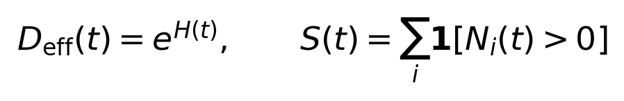

Plain-text equivalent: Effective diversity = exp(Shannon); richness = number of unremoved species.

LaTeX source: `D_{\mathrm{eff}}(t)=e^{H(t)},\qquad S(t)=\sum_i\mathbf{1}[N_i(t)>0]`

Natural logarithms are used. Equal initial abundances give H(0)=ln(25), about 3.219, and effective diversity 25. Unequal abundance can lower Shannon before any extinction. H can fall while richness stays 25 when a few species dominate. When total living biomass is zero, Shannon and effective diversity are exported as NaN, since percentages are undefined. Plotting percentages after complete extinction uses an empty stack only.

Peak biomass, final biomass, biomass-time integral and extinction time supplement binary survival. A rising community percentage can accompany declining absolute biomass. Trait scatter plots are descriptive and do not prove causation; K for a forbidden food has no direct effect. Repeated seeds generate independent communities, while species within each community remain interacting and statistically dependent.

## 6. Parameter values, distributions and ranges

These parameterizations are stated exploratory choices, not literature-fitted constants. Random parameters are sampled once per community. Seeds 42-51 are used for ten matched comparisons; seed 42 is the primary run. The notebook prints empirical min, max, mean, SD, quartiles and medians for each scenario and exports realized_parameter_spread.csv.

| Parameter | Default / sampling | Range / implication |
| --- | --- | --- |
| Species, duration, outputs | 25; t=300; 1201 points | Fixed-volume normalized batch |
| Growth score s | Normal(0.5,0.15), truncated | 0 to 1; mostly intermediate growers |
| Reference rate | 1 per time unit | mu_max = s; no hours assumed |
| Basal death d0 | Normal(0.01,0.003), truncated | Above 0; no imposed upper limit |
| Starvation increment a | Normal(0.06,0.015), truncated | 0 to 0.15; zero in controls |
| Affinity K | exp(Normal(ln(0.1),0.7)) | Clipped to [0.01,1]; median near 0.1 |
| Control affinity K | 0.1 for every food/species | No low-food affinity variation |
| Basic food subsets | Uniform among 7 nonempty subsets | First three forced R0/M1/M2 specialists |
| Structured subset size | 1/2/3 foods: probabilities .7/.2/.1 | Subset chosen uniformly for given size; first 3 forced |
| Preference P | Dirichlet(1,1,1), masked/normalized | 0 to 1; allowed weights sum to 1 |
| Leakage l: basic | 0.2 for all species | 20% of R0 energy goes to metabolites |
| Leakage: structured | 25% none,25% M1,25% M2,25% both | l=0 for none; otherwise 0.2 |
| Secretion split q | Dirichlet(1,1) when both | Sum=1; individual marginal uniform |
| Structured producer guarantee | First R0 specialist produces both | Ensures both products can be made |
| Initial biomass: basic | 0.01 total / 25 | Equal 0.0004 per species |
| Initial biomass: structured | exp(Normal(0,1)), normalized | Positive unequal shares; total 0.01 |
| Initial chemicals | R0=1; M1=M2=0 | Cross-feeders initially wait for food |
| Yield convention | 1 biomass / retained energy | Normalized accounting; not mass yield |
| Cutoff fraction | 1e-6; compare 1e-4 and 1e-8 | Absolute baseline cutoff 4e-10 |
| Abiotic decay and replenishment | 0 for all chemicals | No nutrient input or chemical loss |
| Necromass return | 0 | Death creates no usable food |

The lognormal K distribution is clipped, not truncated: any out-of-range draws are set to the boundary and can create boundary concentrations. Growth and mortality normals are genuinely truncated by resampling from the conditional distribution. Their empirical means need not match the underlying untruncated normal means. Structured starting weights are normalized and therefore dependent across species.

## 7. Assumptions: what they imply and omit

| Assumption | What it does / what it omits |
| --- | --- |
| Well-mixed, fixed volume | All consumers access the same pools; no spatial refuges or diffusion |
| Three substitutable foods | Any permitted food supports growth; essential co-limitation omitted |
| Shared finite uptake allocation | Specialists/generalists differ in portfolios without automatic capacity advantage |
| Fixed uptake permissions | No adaptation, evolution, switching lag or catabolite repression |
| No antibiotics or inhibition | Interactions arise from depletion and secretion, not direct killing or toxin effects |
| Instantaneous starvation mortality | Makes low nutrient-supported growth costly; omits survival memory and dormancy |
| Fixed secretion fractions | Simplifies output; no oxygen-, growth- or pH-dependent overflow |
| No chemical decay | Metabolites persist unless consumed; not a claim of universal chemical stability |
| No dead-biomass recycling | Prevents recovery from necromass; limits realism of long starvation |
| Energy-equivalent biomass | Conserves budget; lacks chemical-specific mass/elemental balances |
| No immigration or serial transfer | Removed species never return; no new feast/famine cycles |
| Finite observation time | Survival is time-specific, not proof of stable coexistence |

The structured scenario increases specialization and removes secretion from some R0 consumers, but it does not force mutualism or extinction. An M1-only producer need not consume M1; permissions are independent. The first R0 specialist produces both metabolites to guarantee potential food supply. Other species can still be poor competitors because of uptake allocations, low nutrient affinity, mortality or initial rarity.

Starvation scale strongly controls late-batch decline: extra mortality 0.06 per time unit can produce roughly exp(-18) decline over 300 fully starved units, before adding basal mortality. This explains why extinctions become possible without raising the cutoff. It is an illustrative sensitivity scale, not evidence that these bacteria die at this rate.

## 8. Interpretation and useful next experiments

Compare the four controlled conditions first. Affinity changes may alter early winners, but after depletion all species receive the same absence of food. Starvation mortality can then dominate final survival. Compare structured separately because multiple changes also alter initial Shannon. Ten-seed paired plots reveal sensitivity to community composition; their spread is not a biological confidence interval.

For stronger conclusions, vary starvation increment scale, affinity spread, leakage and duration separately using the same seeds. Future physiological extensions could add maintenance, dormancy, metabolite toxicity, oxygen/pH limitation or necromass recycling. Repeated nutrient supply would change the experiment from a single finite batch to serial transfer or another supply regime.

## References and scope

Marsland et al. (2020). The Community Simulator: A Python package for microbial ecology. PLOS ONE. doi:10.1371/journal.pone.0230430. Supports the MiCRM framework, Monod response, resource/byproduct accounting and closed-resource settings. The present starvation rule and chosen numeric values are our additions.

Liao et al. (2020). Modeling microbial cross-feeding at intermediate scale portrays community dynamics and species coexistence. PLOS Computational Biology. doi:10.1371/journal.pcbi.1008135. Provides a more mechanistic resource/metabolite framework. This project does not implement its complete metabolic or essential-resource model.